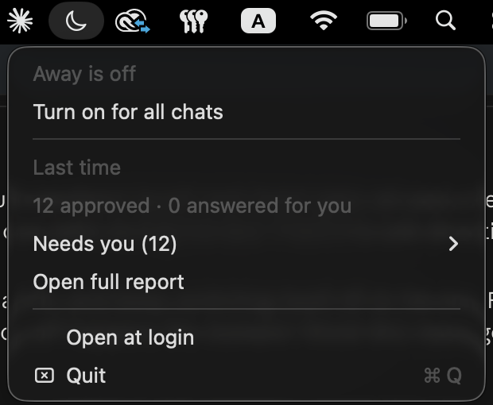

# Away for Claude Code

**Claude keeps working while you sleep. You get a short list in the morning.**



You give Claude Code a big job before bed.
You wake up and it's been sitting on one "Allow?" since 1 AM.

Away fixes that. Normal work goes ahead. Anything risky waits for you.
Nothing blocks the night.

## Start in one minute

In Claude Code:

```
/plugin marketplace add thepurvangmehta/away
/plugin install away@away
```

Then, before you leave:

```
/away:on fix the failing tests and update the docs
```

In the morning:

```
/away:off
```

Optional, on a Mac: `/away:moon` puts a moon in your menu bar. Filled means Away is on.
A number next to it means things are waiting for you.

## Why not just use auto mode, bypass, or /goal?

Use them. Away works alongside them and covers what they leave open.

| What stops Claude at night | Auto mode | Bypass permissions | `/goal` | **Away** |
|---|---|---|---|---|
| "Allow this command?" pop-ups | Mostly handled | Mostly handled (a few protected spots still ask) | Depends on your mode | **Handled** |
| Claude asking you a question | Waits for you | Waits for you | Waits for you | **Goes with its recommended option, tells you later** |
| Browser "allow this site?" and flagged page actions | Sometimes asks | Sometimes asks | Depends on your mode | **Keeps Claude out of the browser, notes it for you** |
| Claude stops early | Stops | Stops | Keeps going | **Keeps going** |
| Risky things (delete, deploy, push to main, send) | Blocked or allowed by a model | **Run without asking** | No change | **Skipped and listed for you, in every mode, Bypass included** |
| What happened overnight | Scroll the chat | Scroll the chat | Scroll the chat | **One morning list** |

Based on Claude Code's own docs as of September 2026: no permission mode auto-approves questions to you.

## How it works

1. `/away:on <job>` switches Away on **for that chat only**. Your other chats behave as normal.
2. Before every action, Away checks it against the risky list. A match is refused and added to **Needs you**,
   whatever permission mode you're in, Bypass included.
3. Every pop-up Claude would still show you is answered in under a second:
   - normal work is approved
   - questions, site approvals and plan approvals are turned into notes instead of waits
4. If Claude stops before the job is done, Away sends it back to work (up to 30 times).
5. When the job is done, Away switches itself off. `/away:off` gives you the report.

It's a small set of Claude Code hooks and three commands. No server, no account, nothing leaves your machine.

## What gets skipped for you

Deleting files · force-pushing or pushing to main · deploying (Vercel, Netlify, Firebase, Wrangler) ·
publishing packages · admin (`sudo`) and system changes · secrets (`.env`, `.ssh`, keychain) ·
running scripts piped from the internet · sending messages · connector actions that send, delete, publish, pay or share.

Your own deny rules in `settings.json` always win.

### Add your own

Create `~/.claude/away.json`:

```json
{
  "name": "Sam",
  "refuse_commands": ["\\bterraform\\s+apply"],
  "refuse_paths": ["/Finance/"],
  "refuse_tools": ["stripe"]
}
```

Each entry is a pattern. A match means "skip it and tell me in the morning".

## Good to know

- **Start in a folder you've used before.** The app's "Do you trust this folder?" screen can't be answered by anything but you.
- **Keep the laptop plugged in.** Away keeps a Mac awake while it's on. On other systems, keep it awake yourself.
- **It's careful on purpose.** A command that only mentions `push` and `main` gets skipped too.
- **Remote Control:** your phone may still buzz for prompts Away already approved (a known Claude Code bug, anthropics/claude-code#96126).
- You're trusting Claude with your machine overnight. Give it work you'd be happy to review in the morning.

Needs Python 3 (already on macOS). The moon needs Apple's free developer tools (`xcode-select --install`).

## Want it set up for your team?

I set up Away for studios and small teams: rules that fit how you work, and jobs that actually finish overnight.
[thepurvangmehta.com](https://thepurvangmehta.com)

---

Made by [Purvang Mehta](https://thepurvangmehta.com), a product designer. MIT license.
Found a pop-up Away doesn't catch? [Open an issue](https://github.com/thepurvangmehta/away/issues).
